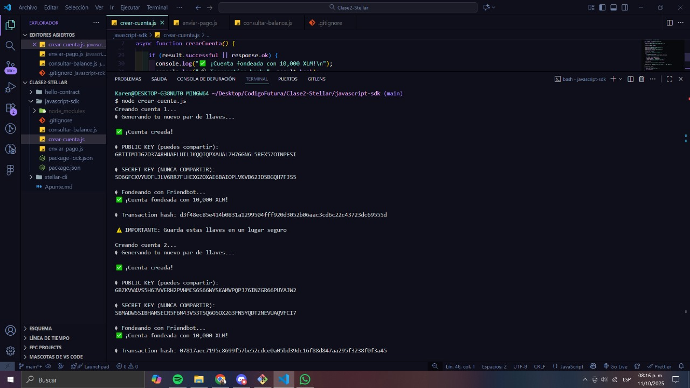
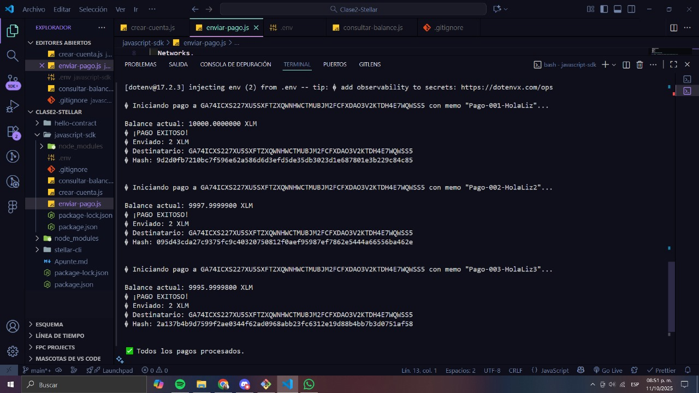
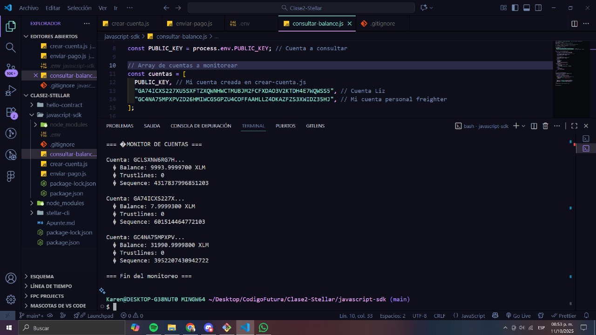

# Síntesis Clase 2 - Fundamentos de Programación Stellar 🦈

## Conceptos Principales Aprendidos

### 1. Stellar SDK (`@stellar/stellar-sdk`)

**¿Qué es?**
Es una biblioteca de JavaScript que proporciona herramientas para interactuar con la red Stellar. Permite a los desarrolladores crear, firmar y enviar transacciones, así como consultar el estado de la red y las cuentas.

**Instalación:**

```bash
npm install @stellar/stellar-sdk
```

### 2. Componentes Fundamentales del SDK

#### **Keypair**

- Clase que representa un par de claves criptográficas (pública y privada)
- Se usa para crear e identificar cuentas en Stellar

#### **Server**

- Permite interactuar con un servidor Horizon (interfaz RESTful de Stellar)
- Proporciona métodos para consultar cuentas, transacciones, operaciones y otros datos

#### **Transaction Builder**

- Facilita la creación de transacciones en la red Stellar
- Permite agregar operaciones, establecer tarifas y tiempos de validez
- Construye transacciones listas para ser firmadas y enviadas

### 3. Stellar CLI

Herramienta de línea de comandos que permite ejecutar las funciones del Stellar SDK directamente desde la terminal.

**Documentación:** https://developers.stellar.org/docs/tools/cli/install-cli

---

## Estructura del Proyecto

Se trabajó con tres subcarpetas principales:

```
proyecto/
├── javascript-sdk/
├── stellar-cli/
└── hello-contract/
```

**Comando para crear carpetas:**

```bash
mkdir javascript-sdk stellar-cli hello-contract
```

---

## Tareas Asignadas

### ✅ Ejercicio 1: Creación Masiva de Cuentas

**Archivo:** `crear-cuenta.js`

**Objetivo:** Modificar el script para crear 5 cuentas automáticamente

**Requisitos:**

- Usar bucle `for` para generar 5 keypairs
- Fondear cada cuenta con Friendbot
- Mostrar: public key, secret key y balance inicial
- Guardar información en un array

**Estructura básica:**

```javascript
for (let i = 1; i <= 5; i++) {
  console.log(`Creando cuenta ${i}...`);
  // Generar keypair
  // Fondear con Friendbot
  // Mostrar información
}
```



### ✅ Ejercicio 2: Sistema de Pagos Automatizado

**Archivo:** `enviar-pago.js`

**Objetivo:** Crear sistema que envíe pagos a múltiples destinos

**Requisitos:**

- Enviar 2 XLM a 3 cuentas diferentes en una ejecución
- Cada pago con memo único
- Verificar éxito de cada transacción antes de continuar
- Mostrar hash de cada transacción

**Estructura de datos:**

```javascript
const destinatarios = [
  { publicKey: "G...1", memo: "Pago-001" },
  { publicKey: "G...2", memo: "Pago-002" },
  { publicKey: "G...3", memo: "Pago-003" },
];
```



### ✅ Ejercicio 3: Monitor de Balances

**Archivo:** `consultar-balance.js`

**Objetivo:** Desarrollar monitor que verifique balances de múltiples cuentas

**Requisitos:**

- Aceptar array de public keys
- Mostrar para cada cuenta:
  - Balance de XLM
  - Número de trustlines activos
  - Sequence number actual
- Formatear salida de manera legible

**Salida esperada:**

```
=== MONITOR DE CUENTAS ===
Cuenta: GBXXX...123
  Balance: 100.50 XLM
  Trustlines: 2
  Sequence: 123456789
```



---

## Recursos Utilizados

### Documentación Oficial

- **Stellar SDK JS:** https://stellar.github.io/js-stellar-sdk/
- **Stellar CLI:** https://developers.stellar.org/docs/tools/cli/stellar-cli
- **Soroban Docs:** https://developers.stellar.org/docs/build/smart-contracts
- **Horizon API:** https://developers.stellar.org/api/horizon

### Herramientas

- **Laboratory:** https://laboratory.stellar.org
- **StellarExpert:** https://stellar.expert/explorer/testnet
- **Friendbot:** https://friendbot.stellar.org

---

## Ejecución de Scripts

Para ejecutar cualquier archivo JavaScript:

```bash
node nombre.js
```

---

## Objetivos de Aprendizaje Alcanzados

✅ **JavaScript + Stellar**

- Transacciones multi-operación
- Programación asíncrona
- Manejo de errores
- Streams en tiempo real

✅ **Stellar CLI**

- Automatización con bash
- Gestión de identidades
- Deploy de contratos

✅ **Pensamiento Crítico**

- Investigación de proyectos
- Identificación de problemas
- Propuesta de soluciones

---

## Información de Entrega

**Fecha límite:** Domingo 12/10 a medianoche  
**Plataforma:** Chamverse (link de GitHub)  
**Modalidad:** Trabajo en equipo, entrega individual  
**Tiempo estimado:** 4-5 horas

---

## Próximos Pasos

**Semana siguiente:**

- 🎯 Aprender Rust
- 🎯 Escribir primer contrato
- 🎯 Construir algo único

---

_Creado para las Tiburonas Builders - Codigo Futura 2025_ 🦈⚡
