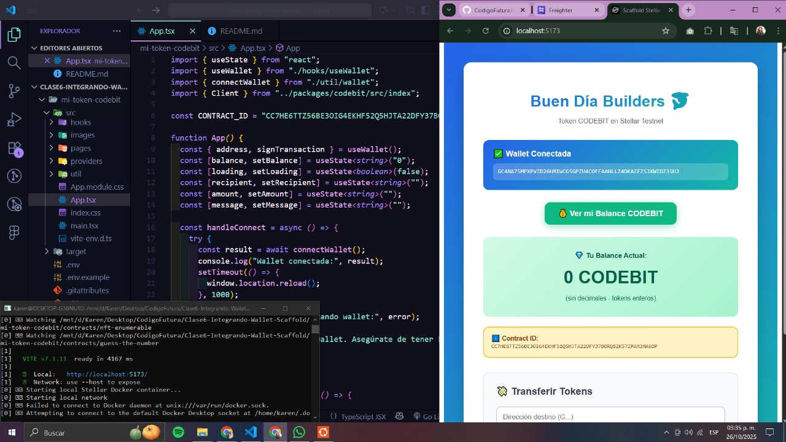

# 🦈 CODEBIT Token - Buen Día Builders

## 📝 Descripción del Proyecto

**CODEBIT** es mi primer token personalizado implementado en la blockchain de Stellar usando Soroban. Este proyecto incluye tanto el smart contract desarrollado en Rust como una interfaz frontend completa en React + TypeScript para interactuar con él de forma intuitiva.

El token permite realizar operaciones fundamentales de transferencia y consulta de balance, conectándose directamente con Freighter Wallet para una experiencia de usuario fluida y segura.

---

## 🎯 Características

- ✅ **Token Fungible en Stellar**: Implementación completa siguiendo estándares de Soroban
- ✅ **Minteo de Tokens**: Capacidad de crear nuevos tokens
- ✅ **Transferencias**: Envío de tokens entre cuentas
- ✅ **Consulta de Balance**: Visualización del saldo en tiempo real
- ✅ **Integración con Freighter**: Conexión segura con wallet browser
- ✅ **Interfaz Moderna**: UI responsive con gradientes y animaciones
- ✅ **TypeScript Type-Safe**: Cliente generado automáticamente desde el contrato

---

## 🚧 Pendientes 

- [ ] Deploy a Netlify/Vercel para acceso público
- [ ] Implementar minteo desde la UI (actualmente solo backend)
- [ ] Agregar historial de transacciones
- [ ] Implementar paginación de transferencias
- [ ] Agregar tests unitarios y E2E
- [ ] Implementar modo mainnet (con toggle)
- [ ] Agregar soporte para múltiples tokens

---

## 🛠️ Stack Tecnológico

### Backend (Smart Contract)
- **Rust** - Lenguaje de programación del contrato
- **Soroban SDK** - Framework para smart contracts en Stellar
- **Stellar CLI** - Herramientas de deployment y testing

### Frontend
- **React 18** - Librería de UI
- **TypeScript** - Tipado estático
- **Vite** - Build tool y dev server
- **Scaffold Stellar** - Boilerplate optimizado para Stellar
- **Freighter API** - Integración con wallet
- **Stellar SDK** - Cliente para interactuar con la blockchain

### Infraestructura
- **Stellar Testnet** - Red de pruebas
- **RPC Soroban** - Nodo para comunicación con la blockchain

---

## 🚀 Proceso de Desarrollo Completado

### 1️⃣ Creación del Smart Contract (Rust)
```bash
✅ Implementé el contrato con funciones:
   - initialize(): Inicializar el token
   - mint(): Crear nuevos tokens
   - balance(): Consultar saldo
   - transfer(): Transferir tokens entre cuentas

✅ Compilé con: stellar contract build
✅ Desplegué en Testnet
✅ Contract ID obtenido: CC7HE6TTZ56BE3OIG4EKHF52Q5HJTA22DFY37BORQB2K57ZPAM3MA6OP
```

### 2️⃣ Setup del Frontend con Scaffold Stellar
```bash
✅ Creé proyecto: stellar scaffold init mi-token-bdb
✅ Integré contrato en: contracts/codebit/
✅ Configuré variables de entorno (.env):
   - VITE_STELLAR_NETWORK=testnet
   - VITE_STELLAR_RPC_URL=https://soroban-testnet.stellar.org
   - VITE_CONTRACT_ID=CC7HE6TTZ56BE3OIG4EKHF52Q5HJTA22DFY37BORQB2K57ZPAM3MA6OP
```

### 3️⃣ Instalación de Dependencias
```bash
npm install
npm install @stellar/freighter-api @stellar/stellar-sdk
```

### 4️⃣ Generación Automática del Cliente TypeScript
```bash
✅ Ejecuté: npm run build:contracts
✅ Se generó: packages/codebit/ con tipos seguros
✅ Cliente listo: clase Client con métodos balance() y transfer()
```

### 5️⃣ Integración de Freighter Wallet
```typescript
✅ Implementé conexión con Freighter
✅ Manejo de public key del usuario
✅ Sistema de firma de transacciones
✅ Feedback visual del estado de conexión
```

### 6️⃣ Desarrollo de la UI
```typescript
✅ Componente principal (App.tsx) con:
   - Botón de conexión a Freighter
   - Visualización de balance en tiempo real
   - Formulario de transferencia con validaciones
   - Mensajes de éxito/error
   - Diseño responsive con gradientes
```

### 7️⃣ Testing Local
```bash
✅ Servidor levantado: npm run dev
✅ Frontend corriendo en: http://localhost:5173/
✅ Conexión exitosa con Stellar Testnet
✅ Transferencias funcionando correctamente
```

---

## 📸 Captura del Proyecto


*Aplicación corriendo en local - Wallet conectada y balance visible*

---

## 🔧 Instalación y Uso

### Prerrequisitos
- Node.js v22.0.0 o superior
- Rust y Cargo
- Stellar CLI
- Freighter Wallet (extensión de navegador)

### Clonar y Configurar
```bash
# Clonar el repositorio
git clone [tu-repo-url]
cd mi-token-bdb

# Instalar dependencias
npm install
npm install @stellar/freighter-api @stellar/stellar-sdk

# Configurar variables de entorno
cp .env.example .env
# Editar .env con tus valores

# Generar cliente TypeScript
npm run build:contracts

# Iniciar servidor de desarrollo
npm run dev
```

### Usar la Aplicación
1. Abrí http://localhost:5173/ en tu navegador
2. Instalá y configurá Freighter Wallet en modo Testnet
3. Cliqueá "Conectar Freighter Wallet"
4. Aprobá la conexión en el popup de Freighter
5. Cliqueá "Ver mi Balance CODEBIT" para consultar tu saldo
6. Usá el formulario de transferencia para enviar tokens

---

## 📁 Estructura del Proyecto

```
mi-token-bdb/
│
├── contracts/
│   └── codebit/                    # Smart contract en Rust
│       ├── src/
│       │   └── lib.rs             # Código del token
│       └── Cargo.toml             # Configuración Rust
│
├── packages/
│   └── codebit/                    # Cliente TypeScript generado
│       └── src/
│           └── index.ts           # Métodos para interactuar con el contrato
│
├── src/
│   ├── App.tsx                    # Componente principal (UI)
│   ├── main.tsx                   # Entry point
│   ├── hooks/
│   │   └── useWallet.ts           # Hook para gestión de wallet
│   └── util/
│       └── wallet.ts              # Utilidades de conexión
│
├── .env                           # Variables de entorno (NO subir a Git)
├── .env.example                   # Template de configuración
├── package.json                   # Dependencias del proyecto
├── vite.config.ts                 # Configuración de Vite
└── README.md                      # Este archivo
```

---

## 🔐 Variables de Entorno

Creá un archivo `.env` en la raíz del proyecto:

```bash
# Red de Stellar
VITE_STELLAR_NETWORK=testnet

# URL del RPC de Soroban
VITE_STELLAR_RPC_URL=https://soroban-testnet.stellar.org

# Contract ID de tu token (reemplazar con el tuyo)
VITE_CONTRACT_ID=CC7HE6TTZ56BE3OIG4EKHF52Q5HJTA22DFY37BORQB2K57ZPAM3MA6OP
```

---

## 🐛 Desafíos y Soluciones

### Problema: Terminal Ubuntu con errores de almacenamiento
**Solución:** Trabajé desde otra terminal y seguí las indicaciones del curso adaptadas a mi entorno.

### Problema: Imports del contrato no reconocidos
```typescript
import game from "../contracts/guess_the_number"; // ❌ Error
```
**Solución:** Asegurarme de ejecutar `npm run build:contracts` antes de importar, y usar la ruta correcta:
```typescript
import { Client } from "../packages/codebit/src/index"; // ✅ Correcto
```

### Problema: Conexión a Freighter
**Solución:** Implementé manejo de errores y reload automático después de conectar:
```typescript
setTimeout(() => {
  window.location.reload();
}, 1000);
```

---

## 📝 Funcionalidades Implementadas

### 1. Conexión de Wallet
- Detección automática de Freighter instalado
- Botón de conexión con feedback visual
- Muestra de dirección pública conectada
- Manejo de errores de conexión

### 2. Consulta de Balance
- Botón para refrescar balance
- Visualización en formato legible (separador de miles)
- Indicador de carga durante la consulta
- Display destacado con gradiente

### 3. Transferencia de Tokens
- Formulario con validaciones:
  - Dirección Stellar válida (empieza con G, 56 caracteres)
  - Cantidad numérica positiva
- Feedback de éxito/error
- Actualización automática del balance post-transferencia
- Limpieza de campos después de transferencia exitosa

---

## 🎨 Diseño de la UI

La interfaz utiliza:
- **Gradientes azul-turquesa** para elementos principales
- **Cards con sombras** para mejor jerarquía visual
- **Hover effects** en botones para mejor UX
- **Color coding** para mensajes (verde=éxito, rojo=error, amarillo=info)
- **Responsive design** que se adapta a diferentes tamaños de pantalla
- **Monospace font** para addresses y contract IDs

---


## 📚 Recursos Utilizados

- [Documentación de Stellar](https://developers.stellar.org/)
- [Soroban Docs](https://soroban.stellar.org/docs)
- [Scaffold Stellar](https://github.com/stellar/scaffold-soroban)
- [Freighter Wallet](https://www.freighter.app/)
- Material del curso **Buen Día Builders**

---

**¡Construyamos el futuro de Web3 juntos! 🚀**